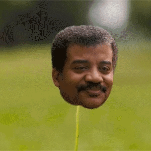

### 2022-3B C109118206 鄞佑珊


---
- [ ] todo list
- [ ] 2nd things
- [x] Sandy
---

python code
```python
s = "Hello Sandy!~~~"
print s
```
javascript code
```js
var s = "Hello Sandy!~~~~";
alert(s);
```

---

Emphasis, aka *italics*,with *asterisks* or *underscores*.

Strong emphasis, aka bold, with **asterisks** or **underscores**.

Combined emphasis with **asterisks and *underscores***.

Strikethrough uses two tildes. ~~Scratch this.~~

---

1. First ordered list item

2. Another item
>..* Unordered sub-list. 

3. Actual numbers don't matter,just that it's a number
>..1. Ordered sub-list
>
>...2. 2nd

4. And another item.
>...* note 1
>
>...* note 2
>
>*** note3

---

---
|**Tables**|**Are**|**Cool**|
|:-------|:---:|-----:|
|col 3 is|right-aligned|$1600|
|col 2 is|centered|$12|
|zebra stripes|are neat|$1|
---
|**Markdown**|**Less**|**Pretty**|
|:---------|:-----|:-------|
|*Still*|`renders`|**nicely**|
|1|2|3|

